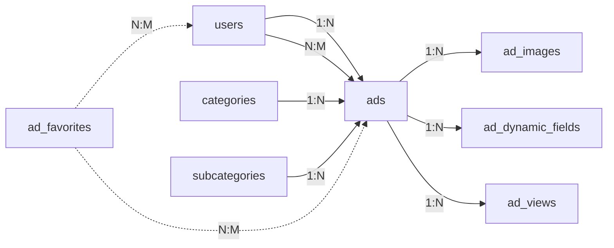

# 📊 دليل قاعدة بيانات سوقة - Souqah Database Documentation

## نظرة عامة

قاعدة بيانات احترافية ومتكاملة لمنصة الإعلانات المبوبة "سوقة" مصممة بأفضل الممارسات.

---

## 🗂️ هيكل قاعدة البيانات

### مخطط العلاقات (ER Diagram)


---

## 📋 الجداول الرئيسية

### 1. جدول المستخدمين (users)

**الوصف**: معلومات المستخدمين وملفاتهم الشخصية

| العمود | النوع | الوصف |
|--------|------|-------|
| `id` | UUID | المعرف الفريد (PK) |
| `name` | VARCHAR(100) | الاسم الكامل |
| `email` | VARCHAR(255) | البريد الإلكتروني (فريد) |
| `phone` | VARCHAR(20) | رقم الجوال (فريد) |
| `badges` | badge_type[] | شارات التحقق |
| `rating` | DECIMAL(3,2) | التقييم (0-5) |
| `total_ads` | INTEGER | إجمالي الإعلانات |

**الميزات**:
- ✅ التحقق من البريد والجوال
- ✅ نظام الشارات (هوية، أعمال، موثوق، مميز)
- ✅ إحصائيات تلقائية

---

### 2. جدول الأقسام (categories)

**الوصف**: الأقسام الرئيسية للإعلانات

| العمود | النوع | الوصف |
|--------|------|-------|
| `id` | UUID | المعرف الفريد (PK) |
| `name` | VARCHAR(100) | اسم القسم |
| `slug` | VARCHAR(100) | الرابط الودي (فريد) |
| `icon` | VARCHAR(10) | الأيقونة |
| `color` | VARCHAR(7) | اللون (#hex) |

**الأقسام المدرجة**:
- 🚗 سيارات
- 🏠 عقارات
- 📱 الكترونيات
- 🛋️ أثاث ومفروشات
- 👔 أزياء وموضة
- 💼 وظائف
- 🔧 خدمات
- 🐾 حيوانات

---

### 3. جدول الإعلانات (ads)

**الوصف**: الجدول الرئيسي لجميع الإعلانات

| العمود | النوع | الوصف |
|--------|------|-------|
| `id` | UUID | المعرف الفريد (PK) |
| `user_id` | UUID | معرف المستخدم (FK) |
| `category_id` | UUID | معرف القسم (FK) |
| `title` | VARCHAR(200) | عنوان الإعلان |
| `description` | TEXT | وصف تفصيلي |
| `price` | DECIMAL(12,2) | السعر |
| `city` | VARCHAR(100) | المدينة |
| `status` | ad_status | الحالة |

**حالات الإعلان**:
- `draft` - مسودة
- `active` - نشط
- `sold` - مباع
- `expired` - منتهي
- `suspended` - موقوف
- `deleted` - محذوف

---

### 4. جدول الصور (ad_images)

**الوصف**: صور الإعلانات مع ترتيب العرض

| العمود | النوع | الوصف |
|--------|------|-------|
| `id` | UUID | المعرف الفريد (PK) |
| `ad_id` | UUID | معرف الإعلان (FK) |
| `image_url` | TEXT | رابط الصورة |
| `is_primary` | BOOLEAN | صورة رئيسية؟ |
| `display_order` | INTEGER | ترتيب العرض |

**قيود**:
- صورة رئيسية واحدة فقط لكل إعلان
- حد أقصى 10 صور

---

### 5. جدول الحقول الديناميكية (ad_dynamic_fields)

**الوصف**: حقول مخصصة حسب القسم

**أمثلة للحقول**:

| القسم | الحقول |
|-------|--------|
| سيارات | الماركة، الموديل، سنة الصنع، الممشى |
| عقارات | المساحة، عدد الغرف، عدد الحمامات |
| الكترونيات | الماركة، الحالة، الضمان |

---

## 🔗 العلاقات



---

## ⚡ الفهارس (Indexes)

### فهارس الأداء الحرجة

```sql
-- البحث السريع في الإعلانات
CREATE INDEX idx_ads_category_status_created 
ON ads(category_id, status, created_at DESC);

-- البحث النصي الكامل (عربي)
CREATE INDEX idx_ads_search 
ON ads USING GIN(to_tsvector('arabic', title || ' ' || description));

-- البحث حسب المدينة
CREATE INDEX idx_ads_city_status_created 
ON ads(city, status, created_at DESC);
```

---

## 🔄 المحفزات (Triggers)

### 1. تحديث الإحصائيات تلقائياً

```sql
-- تحديث عدد إعلانات المستخدم
CREATE TRIGGER trigger_update_user_ad_stats
AFTER INSERT OR UPDATE OR DELETE ON ads
FOR EACH ROW EXECUTE FUNCTION update_user_ad_stats();
```

### 2. تحديث وقت التعديل

```sql
-- تحديث updated_at تلقائياً
CREATE TRIGGER update_ads_updated_at 
BEFORE UPDATE ON ads
FOR EACH ROW EXECUTE FUNCTION update_updated_at_column();
```

---

## 📊 العروض (Views)

### active_ads_view

عرض شامل للإعلانات النشطة مع كافة التفاصيل:

```sql
SELECT * FROM active_ads_view 
WHERE city = 'الرياض' 
ORDER BY created_at DESC 
LIMIT 20;
```

**يتضمن**:
- معلومات المستخدم
- تفاصيل القسم
- الصورة الرئيسية
- جميع الصور

---

## 🛠️ أمثلة الاستخدام

### إضافة إعلان جديد

```sql
-- 1. إدراج الإعلان
INSERT INTO ads (
    user_id, category_id, title, description, 
    price, city, contact_phone, status
) VALUES (
    '123e4567-e89b-12d3-a456-426614174000',
    (SELECT id FROM categories WHERE slug = 'cars'),
    'كامري 2023 فل كامل',
    'سيارة نظيفة جداً...',
    125000,
    'الرياض',
    '0501234567',
    'active'
) RETURNING id;

-- 2. إضافة الصور
INSERT INTO ad_images (ad_id, image_url, is_primary, display_order)
VALUES 
    ('ad-id-here', 'https://...', TRUE, 0),
    ('ad-id-here', 'https://...', FALSE, 1);

-- 3. إضافة الحقول الديناميكية
INSERT INTO ad_dynamic_fields (ad_id, field_name, field_value)
VALUES 
    ('ad-id-here', 'brand', 'تويوتا'),
    ('ad-id-here', 'model', 'كامري'),
    ('ad-id-here', 'year', '2023');
```

### البحث في الإعلانات

```sql
-- البحث النصي
SELECT * FROM active_ads_view
WHERE to_tsvector('arabic', title || ' ' || description) 
      @@ to_tsquery('arabic', 'كامري')
ORDER BY created_at DESC;

-- البحث حسب القسم والمدينة
SELECT * FROM active_ads_view
WHERE category_slug = 'cars'
  AND city = 'الرياض'
  AND price BETWEEN 100000 AND 150000
ORDER BY created_at DESC;
```

---

## 🔒 الأمان

### قيود البيانات

```sql
-- التحقق من صحة البريد الإلكتروني
CONSTRAINT valid_email CHECK (
    email ~* '^[A-Za-z0-9._%+-]+@[A-Za-z0-9.-]+\.[A-Za-z]{2,}$'
)

-- التحقق من رقم الجوال السعودي
CONSTRAINT valid_phone CHECK (
    phone ~* '^05[0-9]{8}$'
)

-- التحقق من السعر
CHECK (price >= 0)
```

---

## 📈 الإحصائيات والتحليلات

### أكثر الأقسام نشاطاً

```sql
SELECT name, total_ads 
FROM categories 
ORDER BY total_ads DESC;
```

### أكثر المستخدمين نشاطاً

```sql
SELECT name, total_ads, rating 
FROM users 
WHERE is_active = TRUE 
ORDER BY total_ads DESC 
LIMIT 10;
```

### الإعلانات الأكثر مشاهدة

```sql
SELECT a.title, a.views_count, a.favorites_count
FROM ads a
WHERE a.status = 'active'
ORDER BY a.views_count DESC
LIMIT 20;
```

---

## 🚀 التثبيت

### 1. إنشاء قاعدة البيانات

```bash
createdb souqah_db
```

### 2. تنفيذ السكيما

```bash
psql -d souqah_db -f database-schema.sql
```

### 3. التحقق

```sql
-- عرض جميع الجداول
\dt

-- عرض الفهارس
\di

-- عرض العلاقات
\d ads
```

---

## 📝 ملاحظات مهمة

> [!IMPORTANT]
> - استخدم UUIDs للمعرفات الفريدة
> - جميع الأوقات بصيغة UTC
> - الحذف الناعم (soft delete) باستخدام `deleted_at`

> [!TIP]
> - استخدم `active_ads_view` للاستعلامات الشائعة
> - الفهارس محسّنة للبحث العربي
> - المحفزات تحدث الإحصائيات تلقائياً

> [!WARNING]
> - لا تحذف البيانات مباشرة، استخدم الحذف الناعم
> - تأكد من النسخ الاحتياطي المنتظم

---

## 📚 المراجع

- [PostgreSQL Documentation](https://www.postgresql.org/docs/)
- [Database Schema File](file:///c:/Users/WinDows/OneDrive/Desktop/2/souqah/database-schema.sql)
